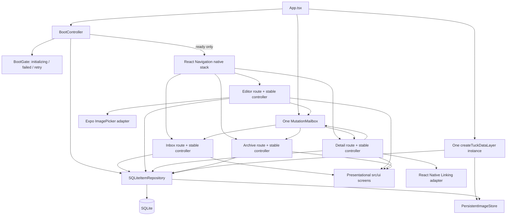

# Tuck Stage 1 — integrated architecture

## Runtime ownership and lifecycle

`App.tsx` constructs the production data layer, picker/link adapters, one shared mailbox, and the boot controller once. The navigator is not mounted until repository initialization succeeds. A failed initialization remains a blocking BootGate with Retry and can never masquerade as an empty Inbox.

Each route creates its C controller with `useMemo`, so ordinary React renders do not replace controller state. `useControllerProps()` subscribes to the controller, forces a render on notification, rereads `controller.props`, and returns the unsubscribe callback during React cleanup. Inbox, Archive, and Detail call `onFocus()` through React Navigation focus lifecycle; this both consumes one-shot destination feedback and refreshes persisted state. Edit Editor calls `load()` on mount.

Native stack headers are hidden and swipe/gesture exits are disabled so they cannot bypass controller guards. A's own Back/Cancel controls call controller callbacks. Android hardware Back is intercepted on Editor and Detail and delegated to `requestExit()` / guarded `onBack()`; Archive delegates to its own Back callback. Inbox leaves hardware Back to normal Android app-exit behavior.

## Data and image consistency

`SQLiteItemRepository` is the source of truth for item metadata. It validates through `src/domain/**`, serializes write operations, and uses `expectedUpdatedAt` for optimistic conflict detection. Image item metadata stores only a safe app-relative `images/...` path.

- Create image: validate/copy new file first, then transactionally insert metadata/tags. A failed DB write cleans or queues the unreferenced copy.
- Replace image: copy new file first; transactionally point metadata to it and queue the old path; remove the old file only after commit. A failed transaction leaves the old item/file intact and cleans the new copy.
- Delete image: transactionally delete metadata and queue the image path; physical removal happens only after commit.
- Cleanup failures from file removal stay in `pending_file_deletions` and are retried at later safe points.
- Startup reconciliation only examines Tuck-owned image storage. A missing physical image resolves to `missing`; item metadata remains listable/editable/archiveable/deletable.

## Search, normalization, and races

Domain validation trims title and type-specific text, normalizes tags with Unicode NFKC + whitespace collapse, and uses lowercase normalized comparison keys for tags/search. Search + type + exact normalized tag + archive state combine with AND; results sort by `updatedAt DESC, id ASC`.

List requests use a generation token before repository load and again after asynchronous image resolution. An old search/filter/image-resolution response cannot replace a newer query. Detail and edit image loads use the same generation principle where an asynchronous resolve follows item loading.

## Mutation results and conflicts

After a confirmed mutation, controllers publish a one-shot `MutationNotice` before navigation. Lists always refresh on focus, so a list that stayed mounted while an item moved between Inbox and Archive becomes current when revisited even if success feedback was addressed to the other list.

Edit conflict handling is intentionally conservative: the local draft is preserved byte-for-byte at the controller level; the latest record is fetched only to obtain the newer optimistic-concurrency baseline. No retry occurs until the user explicitly confirms overwrite. Cancelling the conflict prompt preserves the draft and does not write.

Preview repositories, preview state screens, fixture records, and fixture images are not imported by the production graph.
