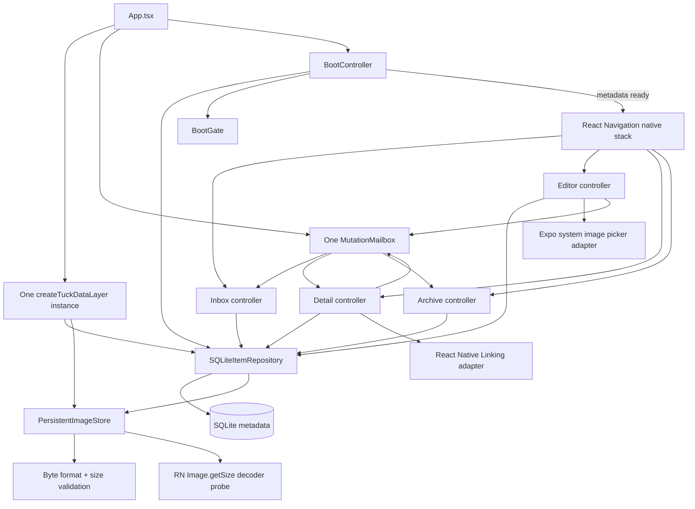

# Tuck Stage 1 — repaired candidate architecture

## Runtime lifecycle

`App.tsx` constructs the data layer, picker/link adapters, one mailbox, and boot controller once. The navigator is not mounted until metadata repository initialization succeeds. Route controllers are `useMemo`-stable, UI subscriptions clean up on unmount, and Inbox/Archive/Detail refresh on navigation focus. Edit Editor loads once for its route instance.

Native stack headers/gestures are disabled where they could bypass controller guards. Android hardware Back delegates to controller boundaries; pending mutations cannot be raced by a second action or Back exit.

For Android library selection, the ImagePicker adapter launches the system image library directly and does not preflight broad media-library permission. The Expo config disables unused camera/microphone permission injection and blocks legacy `READ_EXTERNAL_STORAGE` / `WRITE_EXTERNAL_STORAGE` permissions for this library-only flow. Built-manifest confirmation remains part of native APK verification.

## Fatal startup vs recoverable image maintenance

Phase 4 separates metadata initialization from optional file maintenance.

**Fatal / boot-blocking:** opening SQLite, applying migrations, SQLite `PRAGMA quick_check` integrity verification, or database failure while reading/writing the cleanup/reconciliation metadata. These return `INIT_FAILED`; repository operations remain inaccessible until initialization succeeds.

**Recoverable filesystem maintenance:** a physical file-removal failure leaves its queue row in place, and a filesystem-only image-directory enumeration/reconciliation failure cannot turn readable notes/links/image metadata into a boot failure. Reconciliation stays pending and retries at bounded safe points.

Reconciliation obtains the complete DB image-reference set before asking the image directory for its contents. If filesystem enumeration fails, no deletion is inferred from incomplete information. Database errors are not swallowed as successful initialization.

## Image acceptance and display

A new image follows this order:

1. validate selection shape and actual source availability;
2. enforce the actual 10 MiB limit;
3. read bytes and identify JPEG/PNG/WebP from content, not extension;
4. reject a supplied supported MIME value if it conflicts with detected bytes;
5. call React Native `Image.getSize()` on the source to require native decodability;
6. copy to a uniquely named app-owned file using the detected extension;
7. probe the copied file with the native decoder again;
8. only then return the app-relative path to the repository for metadata commit.

This is deliberately not described as a full codec parser. Byte recognition plus the platform decoder is the acceptance boundary; actual Android provider/decoder behavior remains a device verification item.

For already-stored images, `resolve()` distinguishes an absent file (`missing`) from resolution/storage errors (`unavailable`). Controllers retain metadata for both. UI also handles native `<Image onError>` and switches to a manual-retry fallback without mutating the stored reference, preventing automatic retry loops.

## Database/file mutation consistency

- **Create image:** accepted/copy-complete file first; metadata/tags commit second; failed DB commit cleans or queues the new orphan.
- **Replace image:** accepted new copy first; transaction updates reference and queues old path; old file removal only after commit. Any validation/copy/commit failure leaves the original metadata/reference intact.
- **Delete image:** transaction deletes metadata and queues image path; physical deletion only after commit.
- **Cleanup failure:** queue row remains for later retry and does not resurrect or block metadata.

## Search, tag visibility, and races

Domain validation trims type-specific content, normalizes tags with NFKC + whitespace collapse, and uses lowercase comparison keys. Search + type + exact tag + archive scope combine with AND; results sort `updatedAt DESC, id ASC`.

A mounted list controller remembers normalized display labels it has actually observed. If its currently selected tag later yields zero rows because of another criterion, only that selected known tag is retained in the filter UI so it stays visible/clearable. This does not broaden the repository query or change AND semantics.

List, Detail, and Editor image-related async work uses generation guards so stale resolutions cannot replace newer state.

## Edit target disappearance and conflicts

`NOT_FOUND` is treated differently from transient DB failure. A confirmed missing edit target publishes one informational Inbox notice and navigates safely to Inbox once, whether disappearance is discovered on initial load, conflict refresh, or save. Other repository errors remain in the Editor.

Conflict handling remains conservative: local draft is preserved; newest metadata is held only as a concurrency baseline; no overwrite occurs without explicit confirmation. A second concurrent modification before confirmed overwrite produces another conflict and another confirmation.

Preview repositories, fixture records, and preview state screens are outside the production graph.

## Phase 5B-A data foundation

Phase 5B-A extends the existing repository/data graph only; the Phase 5A native-stack screen graph remains unchanged in this gate.

`SQLiteItemRepository` now implements the item and organisation repository surfaces over schema v2. Schema v2 adds `collections`, nullable `items.collection_id` with `ON DELETE SET NULL`, and persisted `items.pinned`. The existing `item_tags` and image-cleanup architecture remain unchanged.

Startup now follows a versioned `0 -> 1 -> 2` migration chain, with each step transactionally advancing `PRAGMA user_version` only after its schema work succeeds. After migration, `quick_check` plus `foreign_key_check` gate repository readiness. An interrupted v1 -> v2 transaction therefore rolls back to an intact/retryable v1 database rather than exposing a partially upgraded schema.

The repository provides Collection CRUD, collection-aware item create/update/query, dedicated pinning, deterministic sorting, derived Pinned/Untagged/Unfiled query presets, active Collection/tag aggregation, and Library overview data. No Library UI, bottom navigation, organisation sheets, or tag-management mutations are introduced yet; those remain later Phase 5B gates.
