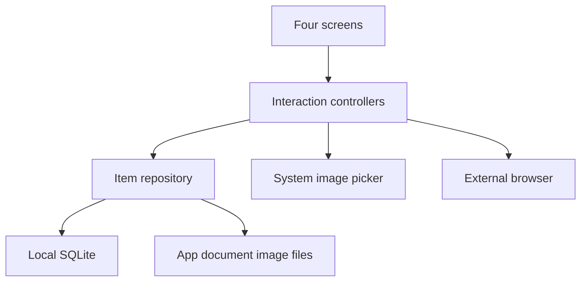

# Stage 1 architecture

The current Phase 1A build contains only the navigator, shared contracts, tokens, a one-shot mutation mailbox, preview-only data, and placeholder screens. UI, controllers, SQLite and file adapters are Phase 1 work. Production `App.tsx` must never import `src/preview/**` or test fixtures. This diagram describes the target Stage 1 architecture, not a currently functioning feature set.
